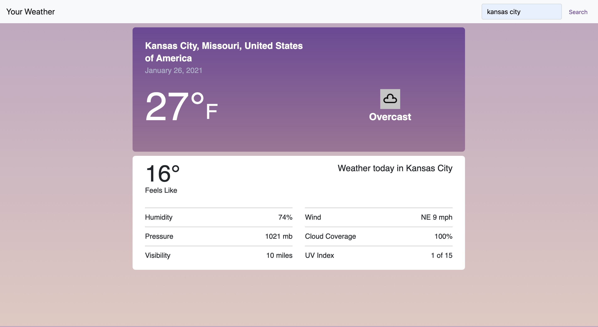

# Your Weather

Website using Weatherstack API. CSS Design inspired by the Weather Channel  

Live at domain address: http://your-weather7.herokuapp.com/ 

## Technology used
- React (ES6)
- Bootstrap
- CSS (responsive design)
- Weatherstack API

## Project Screen Shots

## Reflection

This is one of the first react applications I built. Of course, at the time, fetching the API was something new for me to master. Another challenge was the css design. I was inspired to use a design very close to the design of The Weather Channel's website. Using the free weatherstack API, I was only provided with a handful of data stats. I had to pick the stats I wanted while trying to match the design of The Weather Channel's website. For a simple application, I am pleased with the way it turned out. One of my favorite parts was working with and seeing the results of the CSS gradients.   

This application is live (see address above), while working with Heroku hosting, I was perplexed as to why the application appeared broken when using https. After googling and reading the weatherstack documentation, I found the free Weatherstack API only was available on http. From this I learnt it always helps to keep a level head and think logically through the steps of action.   

## Available Scripts
This project was bootstrapped with [Create React App](https://github.com/facebook/create-react-app).

In the project directory, you can run:

### `npm run start`

Runs the app in the development mode. 
Open [http://localhost:3000](http://localhost:3000) to view it in the browser.

The page will reload if you make edits. 
You will also see any lint errors in the console.

### `npm run test`
Launches the test runner in the interactive watch mode. 
See the section about running tests for more information.

### `npm run build`

Builds the app for production to the `build` folder. 
It correctly bundles React in production mode and optimizes the build for the best performance.

The build is minified and the filenames include the hashes. 
Your app is ready to be deployed!

### `npm run eject`

Note: this is a one-way operation. Once you eject, you can’t go back! 

If you aren’t satisfied with the build tool and configuration choices, you can eject at  any time. This command will remove the single build dependency from your project.  

Instead, it will copy all the configuration files and the transitive dependencies  (Webpack, Babel, ESLint, etc) right into your project so you have full control over  them. All of the commands except eject will still work, but they will point to the  copied scripts so you can tweak them. At this point you’re on your own.  

You don’t have to ever use eject. The curated feature set is suitable for small and  middle deployments, and you shouldn’t feel obligated to use this feature. However we  understand that this tool wouldn’t be useful if you couldn’t customize it when  you are ready for it.  
